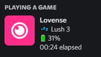

## Lovense Discord Integration
This proof of concept script allows for displaying the status of your Lovense toys on your Discord profile like this

## Instructions
If for whatever reason you want to use this you'll need:
- Python 3.8 installed on your system and installed all dependencies from `requirements.txt` file
- have your toy connected via the `Lovense Connect` 
- make sure your phone is on the same network as your PC
- if you're having any issues change your dns to either Google `8.8.8.8` or Cloudflare `1.1.1.1`

## Disclaimer
This piece of software is not affiliated in any way with Lovense.